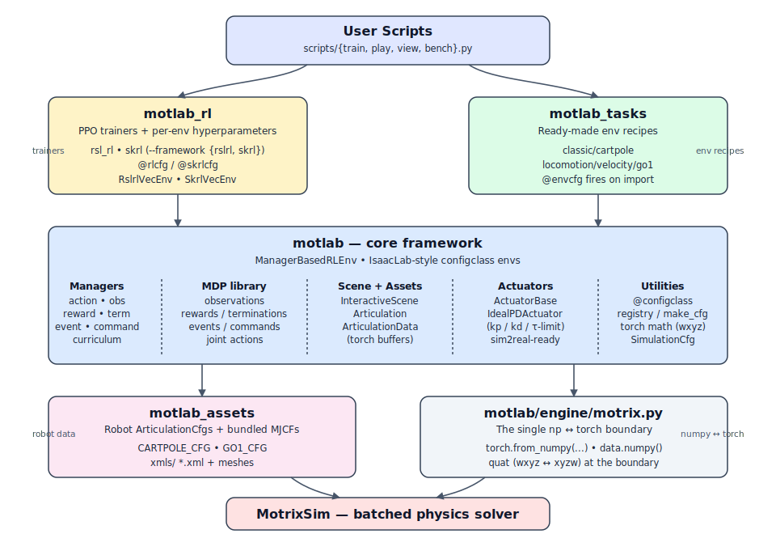

# MotLab

A torch-native reinforcement learning framework for robot training, built on
the [MotrixSim](https://motphys.com) batched physics engine. The architecture
mirrors **IsaacLab** at the package level (four cooperating packages) and at
the API level (`ManagerBasedRLEnv` + `@configclass` cfgs + MDP function
library) — but stays torch-only end-to-end.

```bash
pip install motrixsim torch
pip install -e packages/motlab -e packages/motlab_assets \
            -e packages/motlab_tasks -e "packages/motlab_rl[rslrl,skrl]"
python scripts/train.py --env cartpole
python scripts/train.py --env go1-velocity --num-envs 128
```

---

## Why MotLab

- **Torch-only API** — every tensor that flows through an env (obs, reward,
  terminated, truncated, actions, commands, manager intermediates) is a
  `torch.Tensor` on the env's device. Numpy lives only inside
  `motlab/engine/motrix.py`, the single np ↔ torch boundary.
- **Manager-based envs** — `ManagerBasedRLEnv` composes Action / Observation
  / Reward / Termination / Event / Command / Curriculum managers from
  declarative `@configclass` cfgs.
- **Sim2real-ready actuators** — `IdealPDActuator` (kp / kd / effort limit)
  bridging joint targets and engine torques.
- **Two PPO backends** — `rsl_rl` and `skrl`, selected with
  `--framework {rslrl,skrl}`. Each env may register one, the other, or both.
- **Multi-install** — `uv` workspace, `conda` env, or plain `pip`.

## Architecture



Four cooperating packages keep concerns separated:

| Package           | Role                                                              |
| ----------------- | ----------------------------------------------------------------- |
| `motlab`          | Core: managers, envs, MDP library, `Articulation`, actuators, registry, configclass, math utils. |
| `motlab_assets`   | Robot `ArticulationCfg`s + bundled MJCFs (cartpole, Unitree Go1). |
| `motlab_tasks`    | Ready-made envs (`cartpole`, `go1-velocity`); `@envcfg` fires on import. |
| `motlab_rl`       | PPO trainers + per-env hyperparameters (`rsl_rl`, `skrl`).        |

The `engine/motrix.py` adapter is the only place that touches `motrixsim`'s
numpy buffers — everything above it is pure torch.

## Install

`scripts/install.sh` auto-detects `uv` / `conda` / `pip`; `--rllib` picks
which PPO backend(s) to install.

```bash
bash scripts/install.sh                              # auto-detect, rsl_rl extra
bash scripts/install.sh --method uv  --rllib both    # rsl_rl + skrl
bash scripts/install.sh --method conda
bash scripts/install.sh --method pip --rllib skrl
bash scripts/install.sh --no-extras                  # envs only
```

Step-by-step alternatives:

```bash
# uv workspace
uv sync --all-packages --extra rslrl --extra skrl

# plain pip
python3.10 -m venv .venv && source .venv/bin/activate
pip install motrixsim torch
pip install -e packages/motlab -e packages/motlab_assets \
            -e packages/motlab_tasks -e "packages/motlab_rl[rslrl,skrl]"
```

MotrixSim is on public PyPI; Python 3.10 / 3.11 / 3.12 are supported.

## Common commands

```bash
# Smoke test (pure-Python, no MotrixSim required)
pytest test/ -q

# Random-action rollout
python scripts/view.py  --env cartpole

# Train PPO — pick a backend with --framework
python scripts/train.py --env cartpole
python scripts/train.py --env cartpole --framework skrl
python scripts/train.py --env go1-velocity --num-envs 128 --seed 123

# Throughput benchmark
python scripts/bench.py --env cartpole --num-envs 4096

# Roll out a checkpoint and write an mp4
python scripts/play.py --env cartpole --policy runs/cartpole/.../model.pt \
                       --video out.mp4 --steps 250
```

## Adding a new env

1. **Robot asset** — drop MJCF + meshes into
   `packages/motlab_assets/src/motlab_assets/<robot>/xmls/`, build an
   `ArticulationCfg` in `<robot>.py` exporting `<ROBOT>_CFG`, re-export
   it from `motlab_assets/__init__.py`.
2. **Task cfg** — under `packages/motlab_tasks/src/motlab_tasks/<group>/...`
   subclass `ManagerBasedRLEnvCfg` and define `SceneCfg`, `ActionsCfg`,
   `ObservationsCfg`, `RewardsCfg`, `TerminationsCfg` (and optional
   `EventCfg` / `CommandsCfg`). Decorate with `@envcfg("<name>")` and
   wire it into `motlab_tasks/__init__.py`.
3. **RL hyperparameters** — add a file under
   `packages/motlab_rl/src/motlab_rl/tasks/<name>.py` and decorate the cfg
   class with `@rlcfg("<name>")` (rsl_rl) and/or `@skrlcfg("<name>")`
   (skrl).

See [CLAUDE.md](CLAUDE.md) for the full architecture & contribution guide
(including the `@configclass` field-annotation gotcha and the np ↔ torch
boundary rules).

## Status

| Env             | Obs   | Action | Backends      | Notes                                                       |
| --------------- | ----- | ------ | ------------- | ----------------------------------------------------------- |
| `cartpole`      | 4-d   | 1-d    | rsl_rl + skrl | Reference task, rolls out + trains end-to-end (~150 iter).  |
| `go1-velocity`  | 48-d  | 12-d   | rsl_rl + skrl | Unitree Go1 velocity tracking, `IdealPDActuator`, 8 reward terms. |

`go1-velocity` is currently stable up to ~128 envs; see *Known issues* in
[CLAUDE.md](CLAUDE.md) for the MotrixSim solver bound at larger batches.
